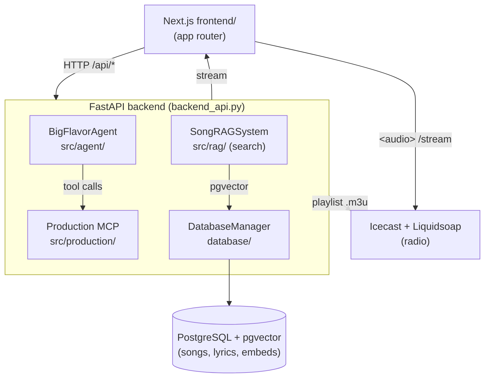

# Architecture — Big Flavor Band Agent

This document captures significant architectural decisions and patterns. Update it when making
decisions that are not obvious from reading the code.

---

## High-Level Structure

An AI music assistant over the Big Flavor Band catalog. A Next.js frontend talks to a FastAPI
backend, which orchestrates an LLM agent, a RAG search system, and a production MCP server over a
PostgreSQL/pgvector database. A separate Icecast + Liquidsoap pair provides the live radio stream.



### Directory layout

```
backend_api.py            # FastAPI app — all HTTP routes, radio state, playlist writer
src/
  agent/big_flavor_agent.py   # LLM orchestration (Claude/Ollama) with tool calling
  rag/
    big_flavor_rag.py         # SongRAGSystem — semantic / text / lyric / hybrid search
    audio_embedding_extractor.py  # CLAP + librosa audio embeddings
    lyrics_extractor.py       # Whisper lyric transcription
    index_lyrics.py           # batch lyric indexing
  llm/llm_provider.py         # LLMProvider abstraction (AnthropicProvider, OllamaProvider)
  production/
    big_flavor_mcp.py         # MCP server host — advertises + dispatches the tool registry
    toolkit.py                # AudioTool base, Param schema, ToolContext, REGISTRY, @register
    audio_io.py               # shared load/write/per-channel helpers + WAV subtypes
    analysis.py               # shared DSP analysis (key/beat/pitch/hum/LUFS + per-tool loaders)
    region.py                 # region scoping (resolve_region/apply_to_region/blend_strength)
    tools/                    # ONE FILE PER TOOL (trim_silence.py, reduce_noise.py, apply_eq.py, …)
database/
  database.py                 # DatabaseManager (asyncpg) — the single DB access point
  apply_schema.py             # schema bootstrap
  sql/init/*.sql              # initial schema (songs, details, audio embeddings)
  sql/migrations/*.sql        # versioned migrations (song_id→int, users table)
frontend/
  app/                         # Next.js app-router pages + /api route handlers (BFF)
  components/                  # React components (AudioPlayer, SongList, SearchBar, …)
    produce/audio/              # Audio-processing review-queue UI (VersionBar, StemConsole,
                                 #   StemRow, StemDetailPanel, FixQueue/FixCard, AdvancedDrawer,
                                 #   ResultSidebar, LyricsCard, Spinner, useStemPlayback,
                                 #   fixCopy.ts, stemColors.ts)
  components/LyricsFollower.tsx # Follow-along lyric highlighting (time-source agnostic)
  hooks/useProcessingQueue.ts  # Data-flow hub for the audio-processing review queue (analyze fan-out,
                                #   FixEntry state, accept/preview)
  hooks/useActiveLyric.ts      # Resolves active lyric line/word from a playback time
  lib/lyricTimings.ts          # Timed-lyric types + pure lookup logic (unit-tested under __tests__/)
  lib/apiJson.ts               # Reads a JSON API body; turns a proxy's HTML error page into a sentence
  lib/concurrency.ts           # mapWithConcurrency — run a batch of API calls a few at a time
  __tests__/                   # vitest + jsdom + React Testing Library (`npm test`)
streaming/
  radio.liq                   # Liquidsoap config
  playlist/radio.m3u          # generated playlist (shared volume backend↔liquidsoap)
scraper/                      # one-off catalog scrapers (bigflavor.com → DB)
tests/                        # ad-hoc Python test/demo scripts (see TESTING.md)
docker-compose.yml            # 7-service stack
```

---

## Backend (FastAPI)

`backend_api.py` is the single HTTP surface. It owns three long-lived singletons initialised at
startup: `agent` (`BigFlavorAgent`), `rag` (`SongRAGSystem`), and `db_manager` (`DatabaseManager`).

Route groups (see the `@app.*` decorators):
- **Users / admin** — `/api/users`, `/api/admin/users`, role management (backed by the users table
  from migration `05`), plus `/api/admin/invites` and `/api/invites/*` for editor invite links
  (migration `13`).
- **Search** — `/api/search/natural`, `/api/search/text`, `/api/search/lyrics`,
  `/api/songs/{id}/lyrics`. These call the RAG system directly (fast path, no LLM round-trip).
- **Agent / DJ** — `/api/agent/chat` (streaming), `/api/agent/dj/request`, `/api/agent/dj/playlist`.
  These go through `BigFlavorAgent` for LLM reasoning + tool calls.
- **Radio** — `/api/radio/state`, `/api/radio/queue/add|remove`, `/skip`, `/play`, `/pause`, plus the
  `/stream`, `/stream.m3u`, `/api/audio/stream/{id}` endpoints.
- **Tools** — `/api/tools/list`, `/api/tools/execute` (exposes the production/MCP tools).

The frontend never calls the backend directly from the browser for protected actions — it proxies
through Next.js `app/api/*` route handlers (a BFF layer that injects auth).

---

## LLM Provider Abstraction

`src/llm/llm_provider.py` defines `LLMProvider` (ABC) with `AnthropicProvider` and `OllamaProvider`
implementations and a `get_llm_provider()` factory. The provider is selected by the `LLM_PROVIDER`
env var (`anthropic` | `ollama`); Ollama (qwen2.5:14b, GPU) is the default in `docker-compose.yml`
for cost-free local inference, with Anthropic Claude as the hosted option. **All agent code goes
through this abstraction — never import `anthropic` directly in agent logic.** Both providers
implement `generate_with_tools()` so tool calling works regardless of backend.

---

## Search & RAG

`SongRAGSystem` (`src/rag/big_flavor_rag.py`) is the read/search path and is called **directly** by
the backend (it is a library, not a service) for speed. It combines:
- **Audio embeddings** — CLAP + librosa features (`audio_embedding_extractor.py`), stored as pgvector.
- **Text/metadata embeddings** — `sentence-transformers` (all-MiniLM-L6-v2, 384 dims).
- **Lyrics** — Whisper-transcribed (`lyrics_extractor.py`, large-v3 model), indexed for full-text +
  semantic lyric search.

**Text search ranking (2026-09-15).** `search_by_text_description` blends two signals, and no LLM is
involved in any of it — a search answers in tens of milliseconds:

- **Semantic** — cosine over `text_embeddings`, which now holds *two* rows per song: `lyrics` and
  `metadata`. The metadata sentence (`build_metadata_text` in `src/rag/search_text.py`: title, genre,
  mood, energy, tempo, key) is what lets a song be found by what it **is**. Before it existed only
  lyrics were embedded, so "melancholic country" could only match songs whose words said so.
  Backfill with `scripts/backfill_metadata_embeddings.py` — idempotent, re-run after any metadata
  sweep.
- **Keyword** — a *bonus*, not a rival score: `tokenize_query` splits the query (the old code matched
  the whole query as one `ILIKE '%…%'`, so multi-word queries never matched), then exact hits on the
  controlled vocabularies (genre/mood/energy) add 0.10 each and title substrings 0.05, capped at
  0.30. The final score is `semantic + bonus`. A flat keyword score used to *replace* the semantic
  one, which left every song of a genre tied at exactly 0.500 and ordered alphabetically.

Candidates are scored semantically even when they surface only via keywords, so ties break on
relevance rather than title.

**Retrieval data (2026-09-16).** Three data shapes feed semantic search, all
embedded with all-MiniLM-L6-v2 and searched as one pool:

- `text_embeddings` content_type `lyrics` — the whole song's words. Still the
  single source of truth for lyric *text*.
- `text_embeddings` content_type `metadata` — the sentence from
  `build_metadata_text`, which now carries **every** mood and genre tag.
- `song_lyric_chunks` (migration `14`) — verse-sized, overlapping pieces of each
  song's lyrics, ~5 per song. A whole-song lyric averaged 850 characters into one
  vector and buried any single mention; chunks let a song be found by the passage
  that matches. Backfill: `scripts/backfill_lyric_chunks.py`.

`song_tags` (migration `15`) holds **multi-label** mood and genre, seeded from the
single `songs.mood`/`songs.genre` columns and extended by
`scripts/backfill_song_tags.py` (~2.9 moods per song). The single columns remain
the primary label; the tags make a song findable as any of the things it is, so
"calm" reaches a song whose primary mood is "melancholic". The keyword branch
matches tags as well as the primary columns. **Re-run the metadata backfill after
a tagging pass** — the tags only reach search once they are embedded.

**In-depth search (2026-09-16).** The search screen is one box and an "In depth"
checkbox; the six mode buttons are gone, because they asked a listener to know
which retrieval strategy their question needed before they had asked it.

- **Quick** is the semantic+keyword pass above — one hop, tens of milliseconds.
- **In depth** runs an agentic loop (`src/rag/deep_search.py` for the prompts and
  parsing, `src/api/research_jobs.py` for the loop and its job manager): plan
  (the model calls the catalogue's own search tools), retrieve, evaluate the
  candidates, iterate with a *different tool* when the evidence is thin, then
  synthesize an answer citing the songs it used. Up to `MAX_ROUNDS` = 3.
- It is a **background job with streamed steps** (`/api/search/deep/start`, then
  poll `/api/search/deep/{job_id}`), for the same reason the accept-fixes render
  is: several model calls outlive a request, and with a reasoning search *what it
  did* is half of what the listener wants to see.
- The model is offered **only read tools** — an in-depth search can never edit
  the catalogue (asserted in `tests/test_research_jobs.py`).
- **Every parser degrades rather than raises.** An unreadable evaluation means
  "we have enough, stop looking", never a failed search: a 14B local model
  produces good tool calls but imperfect JSON.

**Match explanations are on demand.** `/api/search/explain` (`src/rag/explain.py`) explains one song
against one query, when a listener clicks the (i). Search itself used to route through the agent so
every result carried an LLM-written line — 2-12s per search for ranking the agent did not influence
(it called this same RAG function and only annotated it), and the lines were ungrounded enough to
credit a catalogue cover of "Country Roads" to Bob Dylan. The prompt now supplies the song's own
facts and forbids adding any.

**Timed lyrics (2026-08).** Whisper's per-segment (and per-word) timestamps are persisted to
`song_lyric_timings` (migration `11`) as one JSONB `lines` document per song, so the UI can highlight
lyrics in time with playback. The lyric **text** stays in `text_embeddings` (content_type `lyrics`) as
the single source of truth for lyric search — timings are a derived sidecar, never a second row in
that table. Extraction (`src/api/lyrics_jobs.py`) prefers **isolated vocals**, which transcribe and
time markedly better than a full mix: it reuses an existing completed `vocals` stem (issue #67) when
one is on disk, else runs Demucs in-job, falling back to the mix only when separation is unavailable.
A record carries `status` `current`|`stale`; hand-editing the lyric text marks it stale (compared via
`lyrics_jobs.lyrics_signature()`, which ignores case/punctuation/whitespace so a reflow doesn't discard
good timings) and the player then falls back to static lyrics. Read paths: **listener-scoped**
`GET /api/songs/{id}/lyrics/timed` (search router) for playback, and the editor-gated
`GET/PUT /api/produce/songs/{id}/lyrics` which also carries `timings`.

`lyrics_jobs.extract_and_store()` is the single seam for "transcribe one song and persist it" — both the
background job (`LyricsJobManager`) and the catalog backfill script go through it, so the UI's
"Re-extract" button and a batch run can't diverge. `scripts/backfill_lyric_timings.py` drives it over the
whole catalog and is **resumable by construction**: the DB is the checkpoint (a song with a
`song_lyric_timings` row is done), with a JSON ledger only for failures so a permanently broken track
isn't retried forever. It loads Whisper **once** and passes the extractor into every call — the
per-request path correctly builds one per call, which across ~1,300 songs would be hours of pure model
loading. It refuses to run when the text embedding model is missing, since storing lyrics re-embeds them
and a zero-vector fallback across the catalog would silently destroy lyric search.

Search modes: audio similarity, natural-language/text, lyric, tempo (BPM), and hybrid. `pgvector`
provides the vector similarity; SQL search functions live in `database/sql/` and
`database/update_search_functions.sql`.

> **Design split (KISS/SRP):** READ/search = RAG library (in-process, fast). WRITE/production =
> MCP server (`src/production/big_flavor_mcp.py`, isolated process). The agent orchestrates both.

---

## Production MCP Server

`src/production/big_flavor_mcp.py` (`BigFlavorMCPServer`) exposes audio-production/write tools over
the Model Context Protocol (analyze tempo/key/beats via librosa, tempo-match/time-stretch,
beat-matched transitions, mastering). It runs as a separate process so heavy audio work is isolated
from the API event loop.

**Per-tool registry (2026-07):** each tool is a self-contained `AudioTool` subclass in its own file
under `src/production/tools/` (one file per tool — adding a tool = adding a file), registered into
`toolkit.REGISTRY` via `@register`. A tool declares `params` (a list of `Param` with
default/min/max/label/choices that renders as both a JSON inputSchema and a UI control) and implements
`analyze(ctx, …)` (inspect-only: returns `{recommended, params, findings, reason}`) and
`apply(ctx, …)` (the processing). `BigFlavorMCPServer` is a thin host: `list_tools()` and
`dispatch_tool()` are generic loops over the registry, `analyze_tool()` runs the read side, and a
`__getattr__` shim resolves `server.<tool>(…)` to the tool's `apply` (bound to a shared `ToolContext`)
so legacy positional-arg call sites and the auto-clean orchestrator keep working. Shared DSP lives in
`audio_io.py`/`analysis.py`, re-exported from `big_flavor_mcp` so older imports (e.g. `_detect_beats`
in `produce.py`) still resolve. The **per-tool HTTP surface** is `GET /api/produce/tools` +
`POST /api/produce/tools/{tool}/{analyze,apply}` (`src/api/routers/produce.py`), driving the produce
editor's **ToolPanel** (`frontend/components/produce/ToolPanel.tsx`): adjust a tool's params →
Analyze (see findings, optionally adopt suggested values) → Apply (saves a candidate version).

**Region scoping** (`src/production/region.py`): `resolve_region`/`apply_to_region` let a cleanup
tool (trim, hum, noise, EQ) confine itself to a `start_s`/`end_s` span, splicing the processed region
back in with a short crossfade so audio outside it is untouched (bit-identical). Normalize and
Master are **whole-track** operations (peak normalization / integrated LUFS) and never take a region.

**Unified analyze-and-clean pipeline** (`analyze_and_recommend_processing` → `auto_clean_recording`,
now registry tools in `tools/analyze_recommend.py` + `tools/auto_clean.py` — the latter orchestrates
the other tools via `REGISTRY`; reached over `src/api/routers/produce.py`'s `/api/produce/analyze` +
`/api/produce/auto-clean`): the `/produce`
editor's "Whole song" and "Region" selection modes both drive this one pipeline — a region is a scope
passed to `start_s`/`end_s`, not a different tool. Analysis returns a per-step
`recommended_intensity` (gentle/moderate/aggressive) derived from its own measurements (noise floor,
crest factor, EQ correction count); the UI pre-fills each step's raw parameters from that suggestion
and lets the user hand-tune any of them via `step_params` (e.g. `{"master": {"target_lufs": -12}}`),
which always wins over the `aggressiveness`-scaled recommendation. A region request forces
Normalize/Master off regardless of `steps_override`, and region-mode Trim routes through
`trim_silence`'s own scoped silence-trim (not the whole-file crop-to-detected-span path) so it can
never delete audio outside the selected span. Two further steps, `pitch` and `tempo`, are opt-in only
(no analysis measurement recommends either): `pitch` calls the existing `correct_pitch` tool
(auto-tune, key-aware) and is region-scoped like trim/noise/EQ; `tempo` calls the existing
`match_tempo` tool (whole-track time-stretch to an explicit target BPM) and is forced off under a
region exactly like Normalize/Master, since it has no region parameter (issue #82).

**Per-stem analyze/apply (2026-08):** `AudioTool.analyze()`/`apply()` were already file-path-agnostic
(they only ever see a `file_path`), so a separated stem's own audio is just another file to run a
tool against — no DSP changes were needed. `src/api/routers/produce.py`'s `ToolRunRequest` takes an
optional `stem_id`, resolved via `_resolve_tool_source_path` → `db.get_stem`/`db.get_stem_set` (404 on
song-ownership mismatch). A stem-scoped `apply` is always a preview render (no version write) — only
`POST /api/produce/accept-fixes` creates a version, by chain-applying each stem's accepted fixes
(`_chain_apply_tools`, step N's output feeding step N+1), remixing them at unity gain
(`stem_separation.remix_stems`), then chain-applying master-bucket fixes on the remix.
`POST /api/produce/stems/{stem_id}/preview-chain` renders one stem's enabled chain for audition only.
`AudioTool.confidence_tier(value, high, worth, higher_is_worse)` (`toolkit.py`) buckets a tool's own
measured magnitude into `"high"`/`"worth_a_listen"`/`None`, surfaced as `analyze()`'s `confidence` key
on the 7 tools with real measurements — the review-queue UI's per-card confidence tag.

**Full mix as a console row (2026-08):** the stem console's first row is a *pseudo-stem*
(`FULL_MIX_STEM_ID = -1` in `useProcessingQueue.ts`) whose fixes are the master-scoped ones, so the
whole song is played, analyzed and fixed through the same row UI as its parts. It exists only in the
frontend — the accept/apply payloads still carry real stem ids plus a `master_fixes` list, so no
backend code knows about it. It plays through the same mixer but starts **muted**: the stems already
sum to the mix, so an un-muted mix channel would double every part.

**Stem instrument tagging (2026-08):** Demucs' source list is fixed by the model weights
(`htdemucs_6s` = vocals/drums/bass/guitar/piano/other), so a banjo, mandolin or fiddle lands inside
`other` — present in the audio, but unnamed. Rather than separating instruments the model was never
trained on, `src/production/instrument_tagging.py` *labels* each stem with an AudioSet tagger
(`MIT/ast-finetuned-audioset-10-10-0.4593`, multi-label so one stem reports "banjo *and* fiddle"),
mapping AudioSet's comma-separated display names onto a curated producer-facing vocabulary. Scores
are taken as the **max** across evenly-spaced non-silent windows, not the mean — an instrument that
only plays one section must still be reported. An all-silent stem returns `silent: true`, which is a
real answer (a band with no piano still gets a piano stem) and the console hides those rows entirely.
**Silence is judged on peak, not RMS** (`is_silent`, `SILENCE_PEAK` = -40 dBFS): an empty Demucs stem
is low-level bleed rather than digital silence, and measured across real separations empty stems peak
at -56..-52 dBFS while the quietest genuinely-present instrument peaks at -23 dBFS. RMS cannot make
that call — a sparse real piano measured -54.7 dBFS RMS, within 6 dB of an empty stem, while its peak
stayed ~30 dB clear. The check runs *before* windowing, because bleed clears the per-window
`SILENCE_RMS` gate and would otherwise be scored as present-but-unrecognised. Tagging runs in
`stem_jobs.py` *after*
the set is marked complete, best-effort: a tagging failure never fails a separation that produced
usable stems. `song_stems.display_name` lets a producer override the label by hand
(`PATCH /api/produce/stems/{id}`); `POST /api/produce/stems/{id}/identify` is the per-stem retry.
`name` always stays the Demucs source name, because that is what the fix tools resolve against.

**Waveforms and playback audio are separate fetches (2026-08):** the console used to download and
decode every stem's whole audio file, purely so it could draw waveforms — and Demucs writes
uncompressed WAV, so a six-stem set was **~260 MB per tab open** (plus ~640 MB of decoded
`AudioBuffer`). Drawing only ever needed a min/max envelope. Those are now two independent server
resources:

- **Peaks** — `src/production/waveform_peaks.py` reduces a file to a fixed 2000-bucket min/max
  envelope, quantised to ints in ±127 (~15 KB of JSON). Cached in `song_stems.waveform_peaks` /
  `song_versions.waveform_peaks` (JSONB), served by `GET /api/produce/{stems,versions}/{id}/peaks`,
  and warmed by `stem_jobs.warm_stem_peaks` after a separation. The payload carries a `version` field
  that is **checked on read**, so bumping `PEAKS_FORMAT_VERSION` self-invalidates every cached row
  instead of needing a backfill. It also carries `duration_seconds`, which is now what scales the
  transport — the timeline exists before any audio has decoded.
- **Previews** — `src/production/audio_preview.py` transcodes to Opus via ffmpeg (~15x smaller) for
  *browser playback only*, served by `GET /api/produce/{stems,versions}/{id}/preview`. Two rules keep
  this cache invalidation-free: the preview path is derived from the **source file's path**, never a
  row id (produce never overwrites audio in place), and nothing is written outside `produced/`
  (the catalog mount is read-only). Already-compressed sources (the catalog MP3s) are passed through
  rather than re-encoded.

`/audio` still serves the real file and is what every DSP tool — and `StemDetailPanel`'s A/B fidelity
control — reads; the lossy copies never enter the production path. On the client, `WaveformView` now
takes a `Peaks` envelope instead of an `AudioBuffer` and `resamplePeaks` reduces it to the canvas
width (a few thousand ops per resize, against a full-song sample scan before). Because waveforms
arrive well ahead of audio, the transport is gated on `playbackReady` — `useStemPlayback.play()` is a
silent no-op with no decoded buffers, so an enabled-but-dead play button was the regression to avoid.
The full-mix row's *audio* is no longer prefetched at all: it starts muted, so its buffer is only
fetched if the producer un-mutes or solos it.

Two invalidation points exist because a row id can outlive the audio behind it:
`replace_song_version_audio` and `add_stem`'s `ON CONFLICT` both clear `waveform_peaks`. This is also
why the version peaks/preview proxy routes are **uncached** while the stem ones are `immutable` — a
re-separation mints new stem ids, but a re-clean keeps the version id.

---

## Frontend Theming

Dark-only "Console" design system (2026-08) — there is no light mode and no toggle:
`frontend/tailwind.config.ts` sets `darkMode: 'class'` and defines the token palette (`canvas/panel/
raised/well/signal/confirm/attention/text`, plus `stem.{vocals,drums,bass,other,guitar,piano}` accent
colors); `frontend/app/layout.tsx` loads IBM Plex Sans/Mono via `next/font/google` and applies a
permanent `className="dark"` to `<html>`. New components use the token utilities directly
(`bg-panel`, `text-text`); pages migrated before this token set existed still carry paired
`bg-white dark:bg-gray-800`-style Tailwind classes, which now render correctly since `darkMode:'class'`
+ the permanent `dark` class makes the `dark:` variant always win — a page can be migrated to the
token utilities at any time without breaking in the meantime.

---

## Database

- **Engine:** PostgreSQL with the **pgvector** extension (`ankane/pgvector` image).
- **Access:** a single `DatabaseManager` (`database/database.py`, asyncpg). All DB access goes
  through it — credentials come from `DB_*` / `DATABASE_URL` env vars (never hardcoded; moved to
  `.env` in commit `caf28a0`).
- **Schema:** `database/sql/init/*.sql` for the base schema (songs → details → audio embeddings),
  `database/sql/migrations/*.sql` for changes. `song_id` was migrated from string to integer
  (migration `04`); a users table was added for auth/roles (migration `05`), and `user_invites` for
  editor invite links (migration `13`).
- Apply schema with `database/apply_schema.py`; run a single migration with
  `python scripts/run_migration.py <migration-file.sql>`.

---

### Accepting fixes is a background render (2026-09-16)

Analysis **measures**; it never renders. Every detected fix was still unrendered
when a producer pressed a button, so "Accept all & save version" did all the DSP
inside the request — a full queue outlived the edge proxy's 60s read timeout and
the UI could only suggest turning fixes off.

- **Start analysis renders what it found.** As soon as the findings land,
  `warmRender()` starts the full render in the background, because the reason to
  analyse is almost always to hear or keep the result.
- **Renders are reused by fingerprint.** `accept_jobs.fingerprint` hashes the
  source version and every fix with its parameters — *not* the `preview` flag,
  since preview and save render byte-identical audio. An unchanged fix set
  therefore never renders twice: `/accept-fixes/start` returns `complete`
  immediately and the save is an insert (`add_song_version` stores a path, it
  does not copy audio). Change a fix and the fingerprint misses, so it renders.
- **`AcceptJobManager`** (`src/api/accept_jobs.py`) tracks one render per song,
  like `stem_jobs.py`. Status lives in memory because the *result* is durable —
  a saved version is a DB row, a preview is a file on disk.
- **The page follows it** with `useAcceptJob`, which polls on mount (so a reload
  mid-render picks straight back up), shows an in-progress row in the versions
  list, and reloads the list the moment a save lands.

Small previews — one fix, or one stem's chain — still use the synchronous
`POST /api/produce/accept-fixes`, which finishes well inside the proxy's patience.

---

## Radio Streaming (Icecast + Liquidsoap)

Live radio is decoupled from the API. Runtime radio state (current song, queue, play/pause,
position) and the active-listener set are stored **process-externally in PostgreSQL** via
`RadioStateStore` (`database/radio_state_store.py`) — a single-row `radio_state` JSONB table plus a
`radio_listeners` table (migration `06`). The radio endpoints load the state, mutate it, and save it
back on each request, so state survives a backend restart and stays consistent across backend
instances (issue #2). The backend still writes `streaming/playlist/radio.m3u` from that state;
Liquidsoap reads the shared file and streams to Icecast, proxied by nginx at `/stream`. Two
invariants the code depends on (regressions here silently break the stream):
- Liquidsoap playlist sources must be wrapped in `mksafe()` or `fallback` chooses `blank()`.
- Playlist paths are rewritten `/app/audio_library/…` → `/audio_library/…` to match Liquidsoap's
  mount (`write_playlist_file()` in `backend_api.py`).

See `AGENTS.md` → "Radio Streaming Architecture" for the operational details.

---

## Authentication

Google OAuth (Auth0-style) via NextAuth in the frontend (`app/api/auth/[...google]`), supporting
**multiple callback URLs** so the same config works in dev and prod (commit `6718150`). User
records + roles live in Postgres (migration `05`); admin role management is gated through
`/api/admin/*`. Setup is documented in `docs/GOOGLE_OAUTH_SETUP_GUIDE.md`.

**The session cookie is signed** (`frontend/lib/session.ts`): `base64url(payload).HMAC-SHA256`
keyed on `SESSION_SECRET`, with the expiry inside the signed payload. It was previously plain JSON,
so anyone who could send a `Cookie:` header could claim any `sub` — an admin's included. Verification
is constant-time and fails closed; a missing `SESSION_SECRET` means no session is issued or accepted,
and the deploy scripts refuse to start without one. Changing the secret logs everyone out.

Two rules hold across the boundary:

- **The user routes require the service secret**, like `/api/admin/*`, `/api/produce/*` and
  `/api/tools/*` before them: `/api/users` and `/api/users/{id}/role` were the exception until
  2026-09-15 — anything on the Docker network could create users or enumerate roles. They take
  `require_role("listener")`: BFF-only, but not admin-only, since the BFF calls them for whoever
  just signed in. **`search.py` and `agent.py` are still unguarded** (and `radio.py` partly), so
  the boundary is not yet complete — those routes are read-mostly, but the gap is real.
- **Browser-facing paths need a route handler under `app/api/`.** Only `/api/agent/*` is proxied by
  a `next.config.js` rewrite; every other backend path the browser calls is a BFF route handler
  that adds the session check and the service headers. A fetch to a path with neither is a plain
  Next 404 that surfaces as an empty-looking feature — `frontend/__tests__/bffRoutes.test.ts`
  resolves every literal `/api/` fetch in client code against disk to catch exactly that.
- **`requireAuth` fails closed.** A role that cannot be read — backend down, user row missing,
  unknown role — is a refusal. It previously fell through to returning the user whenever the role
  lookup answered with anything but 200, so a backend 404 or 500 passed an admin check.

### Editor invites

Anyone who signs in with Google becomes a `listener`. To make someone an **editor** without an
admin editing the database, an admin creates an invite on `/admin` and copies the link it produces
(there is no mail infrastructure in this stack, so the admin sends it themselves).

- **Rules** (pure, in `src/invites.py`): single-use, expires after 7 days, revocable, and bound to
  the invited email — redemption requires signing in with Google as that exact address, so a
  forwarded link grants nothing. Only `editor` is invitable; `admin` stays a deliberate promotion
  on the `/admin` role dropdown.
- **Storage** (`user_invites`, migration `13`): only the SHA-256 hash of the token is stored. The
  raw token is returned exactly once, at creation, and cannot be shown again.
- **Flow:** `/invite/<token>` previews the invite → `/api/auth/login?invite=<token>` stashes the
  token in a short-lived HttpOnly cookie → the Google callback upserts the user, then redeems the
  invite and lands them on `/invite/accepted`.
- **Single use** is enforced by the conditional `UPDATE` in `DatabaseManager.redeem_invite`, not by
  a read-then-write, so concurrent redemptions cannot both win.

---

## Deployment

Docker Compose, 7 services (see the table in `AGENTS.md`). Production support (`docker-compose`
prod env, nginx SSL, `deploy-production.{sh,ps1}`) was added in commit `c633d34`; SSL handling
refined in `00a73fa`. Details in `docs/DOCKER_DEPLOYMENT.md` / `docs/PRODUCTION_QUICK_START.md`.

---

## Significant Decisions Log

| Date | Decision | Rationale |
|---|---|---|
| 2025-11 | Split READ (RAG library) from WRITE (MCP server) | Search must be fast/in-process; production is heavy and benefits from process isolation. The agent orchestrates both. |
| 2025-11 | `LLMProvider` abstraction (Anthropic + Ollama) | Run a free local model (Ollama/qwen2.5) by default, switch to hosted Claude via one env var — without touching agent logic. |
| 2025-11 | DB credentials moved to `.env` (`caf28a0`) | Stop committing secrets; single `DatabaseManager` reads `DB_*`/`DATABASE_URL`. |
| 2025-11 | `song_id` migrated string→integer (migration `04`) | Stable integer keys for joins, embeddings, and audio-file matching (`{song_id}_*.mp3`). |
| 2025-11 | Whisper large-v3 for lyric transcription (`09bb7ba`) | Higher transcription accuracy enabled reliable full-lyric + semantic lyric search. |
| 2025-11 | Radio = Icecast + Liquidsoap, playlist via shared `.m3u` | Decouple continuous streaming from the request/response API; backend only writes queue state. |
| 2025-11 | `mksafe()` wrapper on Liquidsoap sources | Without it `fallback` picks `blank()` even with valid playlists (sources look "not ready" at init). |
| 2025-12 | Auth0/Google OAuth with multiple callback URLs (`6718150`) | One OAuth app serves both dev and prod redirect URLs. |
| 2026-09 | Session cookies are HMAC-signed with a dedicated `SESSION_SECRET` | An unsigned cookie is not a credential — it is a claim anyone can write. A separate secret from `BACKEND_API_SECRET` so the two blast radii stay separate, and the expiry lives inside the signed payload so a captured cookie cannot be replayed with a fresh `Max-Age`. |
| 2026-09 | Editor invites are copyable links, not emails (migration `13`) | The stack has no SMTP and adding it means new secrets plus SPF/DKIM work for a handful of invites a year. A link the admin sends themselves needs no new infrastructure. Binding the invite to an email keeps a forwarded link worthless. |
| 2025-12 | Production Docker environment + nginx SSL (`c633d34`, `00a73fa`) | Make the stack deployable to a real host, not just localhost. |
| 2026-07 | Per-tool audio registry: one file per tool + `analyze`/`apply` contract | The 3,900-line MCP monolith made adding a tool a 3-place edit and the analyze step all-or-nothing. Every tool — single effects *and* the whole-song `analyze_and_recommend_processing`/`auto_clean_recording` orchestrators — is now a self-contained `AudioTool` under `tools/` with declared params; the server dropped to ~190 lines as a generic host over `REGISTRY` (no audio logic). New `/api/produce/tools/{tool}/{analyze,apply}` surface + ToolPanel give a per-tool "adjust params → analyze → apply" flow; the whole-song one-click clean is preserved, now registry-backed. `region_tools.py`'s param whitelist is derived from the registry. |
| 2025-12 | Frontend shows raw results, not the agent's prose (`eb3a032`) | Surfacing structured search results is clearer for music discovery than an LLM narration. |
| 2026-06 | Radio state externalized to PostgreSQL via `RadioStateStore` (migration `06`, issue #2) | In-memory per-process radio state was wiped on every backend restart and diverged across replicas; backing it with Postgres (no new infra) makes the radio restart-tolerant and stateless (OKR O3.3 / O4.3). |
| 2026-07 | `/produce`'s Region mode reuses the whole-song analyze-and-clean pipeline instead of a separate single-tool flow (issue #77 follow-up) | A region is just a scope (`start_s`/`end_s`), not a different tool — users expect the same "detected issues → tunable steps" experience either way. Region-mode Trim goes through `trim_silence`'s own scoped silence-trim, not the whole-file crop-to-detected-span path, so a mid-track selection can never delete audio outside it. |
| 2026-07 | Per-step `step_params` override wins over `aggressiveness`-scaled recommendations, not a per-step multiplier (issue #77 follow-up) | Keeps one resolution rule (explicit value → else `aggressiveness`-scaled recommendation → else default) instead of the backend tracking five independent intensity dials; the per-step Intensity presets in the UI are computed client-side with the same multiplier formula and sent as explicit overrides. |
| 2026-07 | Pitch correction and Tempo/beat correction restored as opt-in steps inside `auto_clean_recording`, not a separate tool/UI path (issue #82) | PR #81's per-step rework dropped both from the `/produce` UI. Rather than resurrect the old standalone region-tool flow, they're added as two more steps in the one unified pipeline, each with its own controls (no shared Intensity) since no analysis measurement backs either — `pitch` (`correct_pitch`, region-scoped) and `tempo` (`match_tempo`, whole-track only, forced off under a region like Normalize/Master). |
| 2026-07 | Agent pipeline made concurrency-safe + runnable in GitHub Actions (`.github/workflows/fix-issue.yml`) | Ported soccer-assistant-coach's standards: AGENTS.md Concurrency rules (re-check before write; races are benign; dev claims via `dev-agent:claim`; never touch dirty human trees) so local scheduled, interactive, and CI sweeps can overlap safely. CI sweeps trigger on human activity only (marker-filtered `issue_comment`), agents detect CI via `$GITHUB_ACTIONS` and honestly skip Docker-dependent checks. |
| 2026-08 | Dark-only "Console" design system, no light/dark toggle | The source design (a Claude Design mockup) had zero light-mode artifacts and stated "dark because you stare at waveforms"; building a toggle would have been speculative scope nobody asked for. `darkMode:'class'` + a permanent `dark` class on `<html>` also made every pre-existing `dark:` Tailwind class elsewhere in the app activate unconditionally for free, so unmigrated pages don't look broken in the meantime. |
| 2026-08 | Retired `MultitrackEditor.tsx`/`StemMixer.tsx` for a new `produce/audio/` component tree, not an in-place rewrite | The review-queue interaction model (analyze once → one card per fix → accept all) is different enough from the old per-tool-checkbox model that patching in place would have compounded an already-1319-line file. Only the genuinely reusable pieces (the Web Audio group-playback engine, the waveform canvas + region drag-select) were extracted into shared hooks/props instead of duplicated. |
| 2026-08 | Timed lyrics stored in their own `song_lyric_timings` table, not a second `text_embeddings` row | `text_embeddings` is `UNIQUE(song_id, content_type)` around an embedding column and lyric search filters on `content_type`; a `lyrics_timing` row there would risk polluting search results. Timings are always read whole for playback and never queried by field, so one JSONB document per song beats a ~100k-row line table. Lyric text remains the single search source of truth; timings are a derived sidecar that can go `stale` independently. |
| 2026-08 | Lyric transcription runs on isolated vocals (reused stem → in-job Demucs → mix), and word timestamps were enabled before the catalog backfill | Whisper times sung vocals poorly over a full mix. Stem separation (issue #67) often already produced a `vocals` stem, making the better path free for those songs. Both this and `word_timestamps=True` were pulled forward out of "phase 2" specifically so the multi-minute-per-song re-extraction over ~1,300 songs only has to run once. |
| 2026-08 | Follow-along playback reads a **listener-scoped** `/api/songs/{id}/lyrics/timed`, not the produce lyric routes | The existing lyric read/write endpoints sit under `/api/produce/*` behind `require_role("editor")`. Reusing them for the player would have made follow-along lyrics an editors-only feature. |
| 2026-08 | `LyricsFollower` takes a time in seconds, not a player | There are three unrelated playback surfaces (the `<audio>` element player, the produce page's AudioContext `playhead`, the radio's polled position) with very different timing precision. A component that owns no clock serves all three; the radio's coarse 3s-polled position can drive line-level highlighting even though it can never support word-level. |
| 2026-08 | vitest adopted for frontend tests | `lib/lyricTimings.ts`'s active-line/word lookup has real edge cases (seeks, instrumental gaps, shared line boundaries) and the repo had no frontend test runner at all — `lint`/`build` cannot catch a wrong binary search. |
| 2026-08 | Stem-scoped `apply` never writes a version; only `/api/produce/accept-fixes` does | Keeps "create a version" a single seam. Per-stem/per-fix "Hear it" and "Preview with fixes" auditioning needed to be cheap and side-effect-free, so every per-tool or per-stem render is a preview; only the explicit accept-fixes orchestrator (which composes every stem + master fix into one file) is allowed to call `save_candidate_version`. |
| 2026-08 | Tag instruments on stems instead of trying to separate more of them | Demucs' source list is baked into the model weights, so "add banjo/mandolin" is not a config change — it needs either query-based separation (materially worse quality than Demucs on its native sources) or a fine-tune on isolated multitracks the band doesn't have. But nothing is actually *lost*: the 6 stems sum back to the mix, so a banjo is present, just inside `other`. The gap is naming, not coverage — so an AudioSet tagger names what's in each stem and the producer can override the label by hand. Query-based separation stays on the table if per-instrument isolation later proves worth it. |
| 2026-08 | Instrument tagging runs after the stem set is marked `complete`, not before | Separation already takes minutes; making the producer wait on a second model pass before any waveform appears would compound the exact slowness the console was being fixed for. Tags are a labelling pass over stems that already exist, so the console renders immediately and the labels fill in behind via a bounded poll. It also means a tagging failure can't fail a separation that produced perfectly usable stems. |
