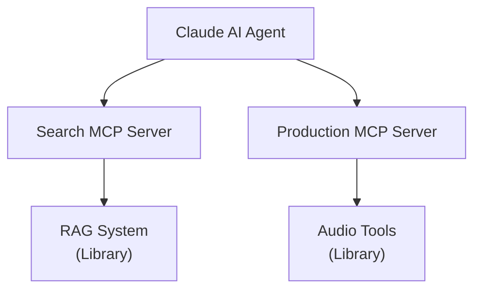

# Architecture Clarification

## The RAG System is a Library, Not a Server

You're absolutely right to question this! The correct architecture is:

### ✅ Correct Architecture



### Key Points

1. **RAG System (`rag_system.py`)** - A **library/module** with search methods
   - `search_by_audio_similarity()`
   - `search_by_text_description()`
   - `search_by_tempo_range()`
   - `search_hybrid()`
   - etc.

2. **Search MCP Server (`rag_mcp_server.py`)** - An **MCP server** that:
   - **Uses** the RAG system library
   - **Exposes** its methods as MCP tools
   - Acts as a thin wrapper/adapter

3. **Production MCP Server (`mcp_server_new.py`)** - An **MCP server** that:
   - Uses audio analysis libraries (librosa, etc.)
   - Exposes production tools

4. **Agent (`claude_dual_mcp_agent.py`)** - **Orchestrator** that:
   - Routes tool calls to appropriate MCP server
   - Maintains conversation with Claude

## Why This Matters

### ❌ Wrong: Making RAG System an MCP Server
- Couples the search logic to the MCP protocol
- Can't reuse RAG system in other contexts
- Violates separation of concerns

### ✅ Right: RAG System as Library + Search MCP Server
- RAG system is reusable (CLI, web app, other servers)
- Search MCP server is just an adapter
- Clean separation: library logic vs protocol handling
- Other applications can import `SongRAGSystem` directly

## Code Structure

### RAG System (Library)
```python
# rag_system.py
class SongRAGSystem:
    """Library for semantic search over songs."""
    
    async def search_by_audio_similarity(self, ...):
        # Core search logic here
        pass
```

### Search MCP Server (Adapter)
```python
# rag_mcp_server.py
class BigFlavorSearchMCPServer:
    """MCP Server that exposes RAG system as MCP tools."""
    
    def __init__(self):
        self.rag_system = SongRAGSystem(...)  # Uses the library
    
    async def search_by_audio_file(self, ...):
        # Thin wrapper - just calls the library
        return await self.rag_system.search_by_audio_similarity(...)
```

## Benefits

1. **Reusability**: RAG system can be used in:
   - MCP servers
   - Web APIs
   - CLI tools
   - Batch processing scripts
   - Other projects

2. **Testability**: Can test RAG logic without MCP infrastructure

3. **Flexibility**: Can swap out search implementation without changing MCP interface

4. **Clean Architecture**: Clear layers of responsibility

## Updated Files

- ✅ `rag_system.py` - Remains a library (unchanged role)
- ✅ `rag_mcp_server.py` - Renamed to `BigFlavorSearchMCPServer`, clarified as adapter
- ✅ `claude_dual_mcp_agent.py` - Updated to call `search_server` instead of `rag_server`
- ✅ `test_dual_mcp.py` - Updated to test Search MCP server
- ✅ All files compile successfully

## Summary

**Before your question:**
- I mistakenly made it seem like RAG system WAS an MCP server

**After clarification:**
- RAG system = Library with search logic
- Search MCP Server = Thin adapter that exposes RAG system via MCP
- Much cleaner separation of concerns!

Thank you for catching this - it's a much better architecture now! 🎯
