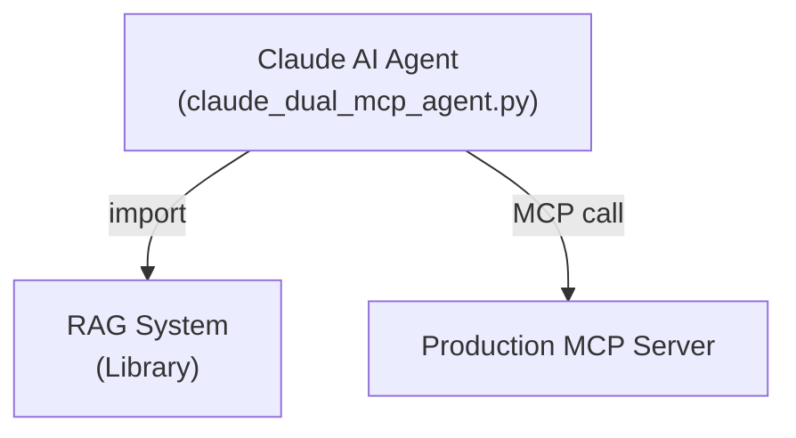

# Simplified Architecture - No Unnecessary MCP Server!

## You Were Right!

The Search MCP Server (`rag_mcp_server.py`) was **unnecessary complexity**. Since the agent runs in the same process as the RAG system, it can just import and use it directly!

## ✅ Correct Simplified Architecture



### Components

1. **RAG System** (`rag_system.py`)
   - Python library
   - Direct import: `from rag_system import SongRAGSystem`
   - Direct method calls: `await rag_system.search_by_audio_similarity(...)`
   - ✅ No MCP overhead

2. **Production MCP Server** (`mcp_server_new.py`)
   - Separate process for audio production
   - Needed because audio processing might be:
     - Resource-intensive
     - Long-running
     - Better isolated
   - ✅ MCP justified here

3. **Agent** (`claude_dual_mcp_agent.py`)
   - Direct RAG system access (library import)
   - MCP calls to production server
   - Best of both worlds!

## Why This Is Better

### ❌ Old Way (Unnecessary MCP Server)
```python
# Agent → Search MCP Server → RAG System
await self.search_server.search_by_audio_file(...)  # Extra layer!
```

**Problems:**
- Extra serialization/deserialization
- Extra network overhead (even if localhost)
- Extra process to manage
- More complex debugging
- No performance benefit

### ✅ New Way (Direct Library Access)
```python
# Agent → RAG System (direct)
await self.rag_system.search_by_audio_similarity(...)  # Direct!
```

**Benefits:**
- ✅ Simpler code
- ✅ Faster (no MCP overhead)
- ✅ Easier debugging
- ✅ Fewer moving parts
- ✅ Same Python process

## When To Use MCP vs Direct Import

### Use Direct Import (Library) When:
- ✅ Same process/application
- ✅ Fast operations
- ✅ Need tight integration
- ✅ Python-to-Python communication

### Use MCP Server When:
- ✅ Separate process needed
- ✅ Resource-intensive operations
- ✅ Language/platform boundary
- ✅ Network access required
- ✅ Multiple clients need access

## Updated Architecture

### Agent Code (Simplified)
```python
class ClaudeRAGMCPAgent:
    def __init__(self):
        # Direct RAG system import
        from rag_system import SongRAGSystem
        self.rag_system = SongRAGSystem(...)
        
        # Production server via MCP
        from mcp_server_new import BigFlavorMCPServer
        self.production_server = BigFlavorMCPServer(...)
    
    async def _call_tool(self, tool_name, tool_input):
        if tool_name == "search_by_audio_file":
            # Direct library call - fast!
            return await self.rag_system.search_by_audio_similarity(...)
        
        elif tool_name == "analyze_audio":
            # MCP server call - isolated process
            return await self.production_server.analyze_audio(...)
```

## Files Status

### Keep (Essential)
- ✅ `rag_system.py` - Core search library
- ✅ `mcp_server_new.py` - Production MCP server
- ✅ `claude_dual_mcp_agent.py` - Simplified agent
- ✅ `test_dual_mcp.py` - Updated tests

### Can Remove
- ❌ `rag_mcp_server.py` - Unnecessary wrapper (kept for reference)

## Tool Routing

```python
{
  "search_by_audio_file": {
    "method": "Direct library call",
    "handler": "self.rag_system.search_by_audio_similarity()"
  },
  "search_by_text_description": {
    "method": "Direct library call",
    "handler": "self.rag_system.search_by_text_description()"
  },
  "analyze_audio": {
    "method": "MCP server call",
    "handler": "self.production_server.analyze_audio()"
  },
  "match_tempo": {
    "method": "MCP server call", 
    "handler": "self.production_server.match_tempo()"
  }
}
```

## Performance Comparison

### Search Operation

**With MCP Server** (old way):
```
Agent → MCP Protocol → Search Server → RAG System → Database
~20-50ms overhead
```

**Direct Library** (new way):
```
Agent → RAG System → Database
~0ms overhead
```

### Production Operation

**With MCP Server** (kept, justified):
```
Agent → MCP Protocol → Production Server → Audio Processing
Isolation is valuable for heavy processing
```

## Summary

- **RAG System** = Library (direct import)
- **Production Server** = MCP Server (justified isolation)
- **Agent** = Orchestrates both

**Result**: Simpler, faster, cleaner architecture! 🎯

Thank you for questioning this - the simplified architecture is much better!
