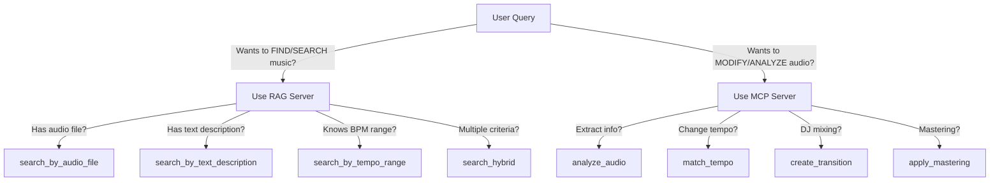
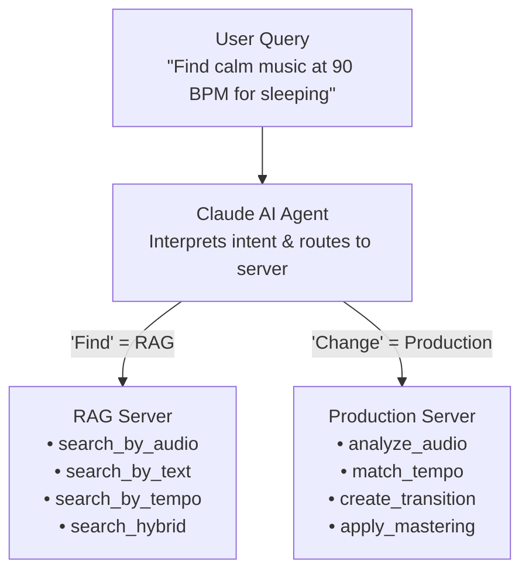

# Tool Routing Guide

## Quick Reference: Which Server Handles What?

### 🔍 RAG Server (Search/Read Operations)

Use for: **Finding** songs, **discovering** music, **searching** the library

| Tool | Description | Example Query |
|------|-------------|---------------|
| `search_by_audio_file` | Find similar-sounding songs | "Find songs like this.mp3" |
| `search_by_text_description` | Natural language search | "Find calm jazz for studying" |
| `search_by_tempo_range` | Search by BPM | "Find songs between 120-130 BPM" |
| `search_hybrid` | Multi-criteria search | "Find upbeat rock at 140 BPM" |

**When to use RAG Server:**
- "Find songs that..."
- "Search for..."
- "Show me..."
- "What songs are..."
- "Recommend..."

---

### 🎛️ MCP Server (Production/Write Operations)

Use for: **Modifying** audio, **analyzing** files, **creating** new versions

| Tool | Description | Example Query |
|------|-------------|---------------|
| `analyze_audio` | Extract BPM, key, beats | "What's the tempo of this song?" |
| `match_tempo` | Time-stretch to target BPM | "Change this to 128 BPM" |
| `create_transition` | Beat-matched DJ mix | "Mix these two songs together" |
| `apply_mastering` | Professional mastering | "Master this track to -14 LUFS" |

**When to use MCP Server:**
- "Analyze..."
- "Change..."
- "Convert..."
- "Master..."
- "Create a transition..."
- "Make this..."

---

## Decision Tree



---

## Examples by Use Case

### Finding Music for a Playlist

```
User: "I need calm background music for studying"
→ RAG Server: search_by_text_description("calm study background")

User: "Find songs that sound like Norah Jones"
→ RAG Server: search_by_audio_file("norah_jones_sample.mp3")

User: "Show me all songs around 90 BPM"
→ RAG Server: search_by_tempo_range(min=85, max=95)
```

### DJ/Production Workflow

```
User: "What's the BPM of track1.mp3?"
→ MCP Server: analyze_audio("track1.mp3")

User: "Make track2.mp3 the same tempo as track1"
→ MCP Server: match_tempo("track2.mp3", target_bpm=120, output="track2_120.mp3")

User: "Create a smooth transition from track1 to track2"
→ MCP Server: create_transition("track1.mp3", "track2.mp3", output="mix.mp3")

User: "Master the final mix"
→ MCP Server: apply_mastering("mix.mp3", output="mix_mastered.mp3")
```

### Combined Workflow

```
1. User: "Find energetic workout songs"
   → RAG Server: search_by_text_description("energetic workout")

2. User: "Find more songs like the first result"
   → RAG Server: search_by_audio_file(result_1_path)

3. User: "Analyze the tempo of my favorite workout song"
   → MCP Server: analyze_audio("workout_song.mp3")

4. User: "Match all these songs to 140 BPM"
   → MCP Server: match_tempo(each_song, 140, outputs)

5. User: "Create a seamless workout mix"
   → MCP Server: create_transition(songs, output="workout_mix.mp3")
```

---

## Architecture Flow



---

## Quick Tip Sheet

| If you want to... | Use this server | Use this tool |
|-------------------|-----------------|---------------|
| Find similar songs | RAG | `search_by_audio_file` |
| Search by mood/genre | RAG | `search_by_text_description` |
| Find songs by BPM | RAG | `search_by_tempo_range` |
| Complex search | RAG | `search_hybrid` |
| Get song info | MCP | `analyze_audio` |
| Change tempo | MCP | `match_tempo` |
| Mix songs | MCP | `create_transition` |
| Make louder/better | MCP | `apply_mastering` |

---

## Remember

- **RAG = Read/Retrieve** (searching, finding, discovering)
- **MCP = Write/Produce** (modifying, creating, analyzing)
- The agent automatically routes to the correct server
- You can use both servers in the same conversation
